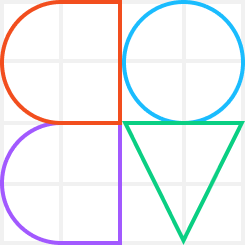

A boilerplate for creating Figma plugins using Vue.

Equipped with TypeScript and linting.
Image assets will be inlined during build ([Reason is that Figma does not support relative or external assets](https://www.figma.com/plugin-docs/resource-links/)).

The boilerplate ships with [figma-plugin-ds-vue](https://github.com/alexwidua/figma-plugin-ds-vue), a Vue UI component library that matches the Figma Design System. Refer to the library's [documentation](https://figma-plugin-ds-vue.netlify.app/) for usage.

## 🏗️ Installation

1. `npm install` — Install all dependencies
2. Install your plugin locally in Figma
    - _Right-click on a canvas_ > _Development_ > _New plugin..._ or navigate to _Plugins_ in your profile menu
    - _Link existing plugin_ and select this project's `manifest.json`

## 🚧 Development

The plugin's logic lives in `./src/code/index.ts`.
The UI (Vue app) lives in `./src/ui`.

1. `npm run serve` — Serves the plugin's UI to your browser\*
1. `npm run watch` — Bundles the plugin and watches for changes. Useful for development and testing within Figma
1. `npm run build` — Bundle the plugin for production

\* When serving to the browser, your Vue app will be wrapped in a window which visually emulates the Figma plugin modal. To disable, delete line 35-39 and uncomment line 40 in the project's `vue.config.js` file.

## 🚀 Publishing your plugin

To publish your plugin, you need to generate a plugin ID and put it in the project's `manifest.json` file.

1. Go to your plugin settings and create a new plugin (_Right-click on a canvas_ > _Development_ > _New plugin..._ or navigate to _Plugins_ in your profile menu)
2. Choose a plugin name (the name doesn't matter, we're only after the generated ID) and choose the _Empty_ template
3. Save the folder, navigate to the folder and grab the id from the folder's `manifest.json`
4. Paste the id to this project's `manifest.json` file
5. `npm run build` to bundle your plugin and inline all assets
6. Read through the [Publishing](https://www.figma.com/plugin-docs/publishing/) section of Figma's plugin docs and make sure that your plugin deals with edge-cases and works as expected
7. Publish 🚀

## 📝 License

[MIT](LICENSE)
